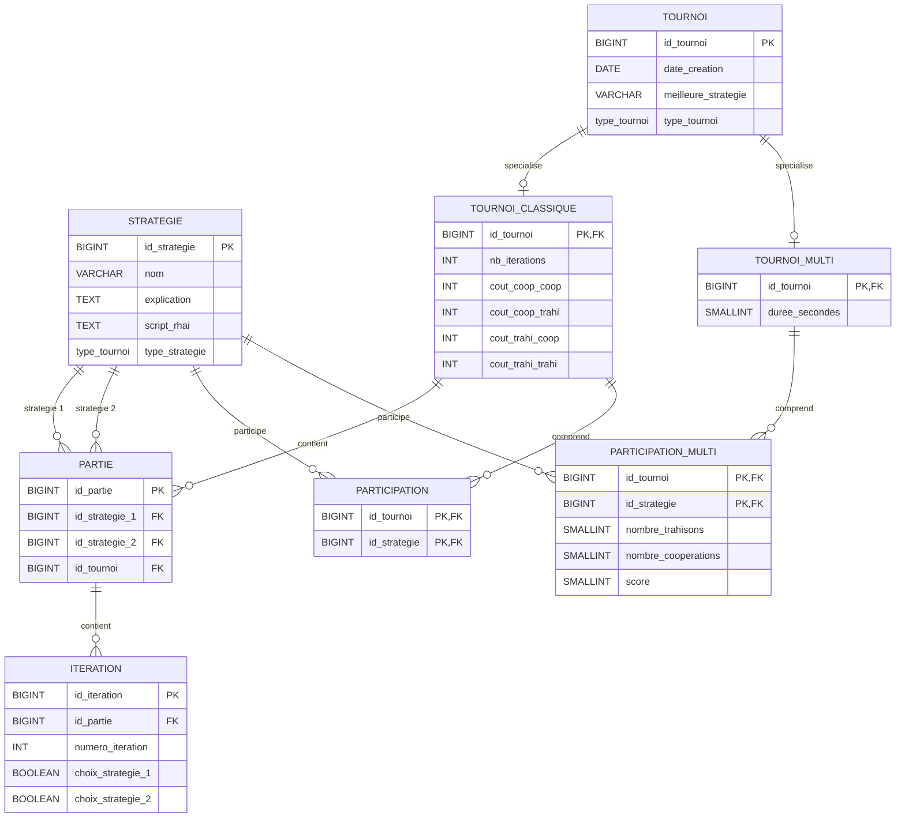

# Base de donnees

Ce dossier contient le script d'initialisation PostgreSQL du projet.

## Fichier

- `init.sql` : cree les tables, contraintes, triggers et strategies initiales.

## Initialisation Docker

Dans `docker-compose.yml`, le script est monte dans le conteneur PostgreSQL :

```yaml
./db/init.sql:/docker-entrypoint-initdb.d/init.sql
```

PostgreSQL execute ce script uniquement lors de la premiere creation du volume de donnees. Si le volume `postgres_data` existe deja, modifier `init.sql` ne rejouera pas automatiquement le script.

## Acces

Depuis la racine du projet :

```bash
docker compose exec postgres psql -U bastienbogoss -d prisoners-dilemma
```

Ou avec le Makefile :

```bash
make postgres-shell
```

Parametres par defaut :

- hote depuis Docker Compose : `postgres` ;
- hote depuis la machine : `localhost` ;
- port : `5432` ;
- base : `prisoners-dilemma`.

## Schema de la base de donnees


@enduml
```
